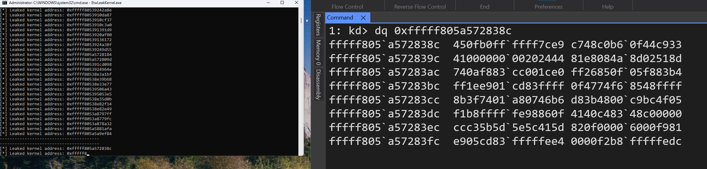

# EtwLeakKernel

This repository contains a PoC for a program that utilizes ETW to leak kernel memory addresses. It does so by creating a consumer (could be to almost any provider as almost all of them leak kernel addresses) and requesting a stack trace from it. Once the stack trace is received, it is parsed to extract the kernel memory addresses. Since Microsoft do not consider administrator to kernel as a security boundary, this situation won't change any time soon. Might be useful in some exploitation scenarios (**e.g. wanting to leak the kernel base address if you know that an ETW provider leaks a kernel address which is in a certain offset from the kernel base address or any other interesting address for that matter**) or just as a party trick.

**Bare in mind** that administrative privileges are required to *start consuming* from ETW providers. If there is already a program that consumes ETW events that normal user has access to the trace, the normal user will be able to leak kernel addresses as well. It does not provide any leak of actual kernel data, just kernel addresses (unless in maybe an extreme edge cases).



## Usage

You can see an example of how to use in [EtwLeakKernel](./EtwLeakKernel/EtwLeakKernel.cpp). You can also use any other ETW consumer and request the stack, in this example it is using `Microsoft-Windows-Kernel-Network`.

## Setup

### Requirements

- [VS 2022](https://visualstudio.microsoft.com/vs/)

### Cloning

```shell
git clone https://github.com/Idov31/EtwLeakKernel --recursive
```
